# PRO AIR - Sistema de Reserva de Vuelos

Bienvenido a PRO AIR, un sistema web moderno y futurista para la reserva de vuelos. Este proyecto fue diseñado con una estética espacial y neon, ofreciendo una experiencia de usuario fluida y atractiva.

## 🚀 Características

- **Diseño moderno**: Interfaz con tema Neon Espacial y efectos glow
- **Responsive**: Funciona perfectamente en móviles, tablets y escritorio
- **Navegación intuitiva**: Barra de navegación adaptativa según el dispositivo
- **Flujo completo**: Desde el login hasta el pago de vuelos
- **Loading screens**: Pantallas de carga para mejor experiencia de usuario
- **Tipografía personalizada**: Fuente Michroma para un look futurista

## 🛠 Tecnologías

- **HTML5**: Estructura semántica
- **CSS3**: Estilos con variables CSS, flexbox, grid y animaciones

## 📦 Instalación

1. Clona el repositorio:
```bash
git clone https://github.com/Moraless0/pro-air-html-css.git
```

2. Navega al directorio del proyecto:
```bash
cd pro-air-html-css
```

3. Abre `index.html` en tu navegador para comenzar

## 🌐 Estructura del Proyecto

```
pro-air-html-css/
├── css/
│   ├── style.css          # Variables CSS y estilos base
│   ├── forms.css          # Estilos de formularios
│   ├── layout.css         # Layout y componentes
│   └── responsive.css     # Media queries para responsive
├── fonts/
│   └── Michroma-Regular.ttf  # Fuente personalizada
├── img/
│   └── icons/             # Imágenes del proyecto
├── index.html             # Login
├── menu.html              # Menú principal
├── registro.html          # Registro de usuarios
├── crear-contraseña.html  # Creación de contraseña
├── recuperar.html         # Recuperar contraseña
├── buscar-vuelos.html     # Búsqueda de vuelos
├── vuelos.html            # Lista de vuelos disponibles
├── pago.html              # Pago de reservas
├── checkin.html           # Check-in online
├── mis-vuelos.html        # Mis vuelos reservados
├── loading-login.html     # Loading después de login
├── loading-busqueda.html  # Loading después de búsqueda
└── loading-pago.html      # Loading después de pago
```

## 🎨 Tema Neon Espacial

El proyecto utiliza una paleta de colores inspirada en el espacio:

- **Primario**: Azul (#3B82F6)
- **Secundario**: Cyan (#06B6D4)
- **Fondo**: Oscuro espacial (#050816)
- **Superficie**: Gris oscuro (#1E293B)
- **Texto**: Blanco grisáceo (#E2E8F0)

Los efectos glow (resplandor) se aplican en botones, enlaces y elementos interactivos para dar una sensación futurista.

## 📱 Responsive Design

El diseño se adapta automáticamente:

- **Móvil** (< 768px): Navegación compacta, tabla scrollable
- **Tablet** (768px - 1023px): Layout intermedio
- **Escritorio** (≥ 1024px): Navegación completa, layout expandido

## 🔧 Personalización

### Cambiar colores

Edita las variables CSS en `css/style.css`:

```css
:root {
    --color-primary: #3B82F6;
    --color-secondary: #06B6D4;
    /* ... más variables */
}
```

## 🚀 Flujo de Usuario

1. **Login**: Ingresa con tu correo y contraseña
2. **Menú**: Elige qué quieres hacer (buscar vuelos, ver mis vuelos, check-in)
3. **Búsqueda**: Busca vuelos por origen y destino
4. **Selección**: Elige el vuelo que prefieras
5. **Pago**: Completa el proceso de pago
6. **Check-in**: Realiza el check-in online
7. **Mis Vuelos**: Consulta tus reservas activas

## 📸 Capturas del Proyecto

### Vista Escritorio

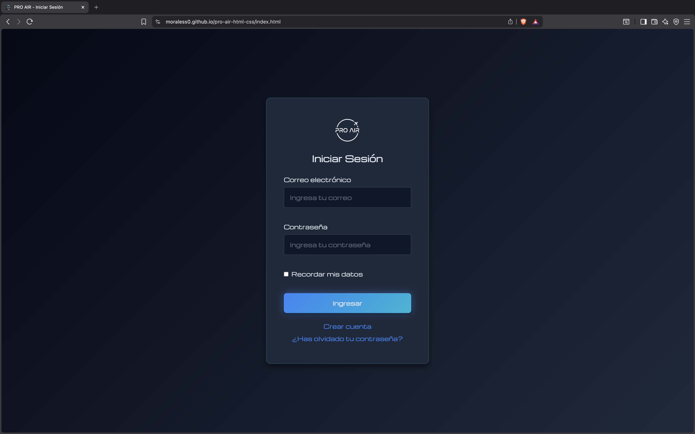
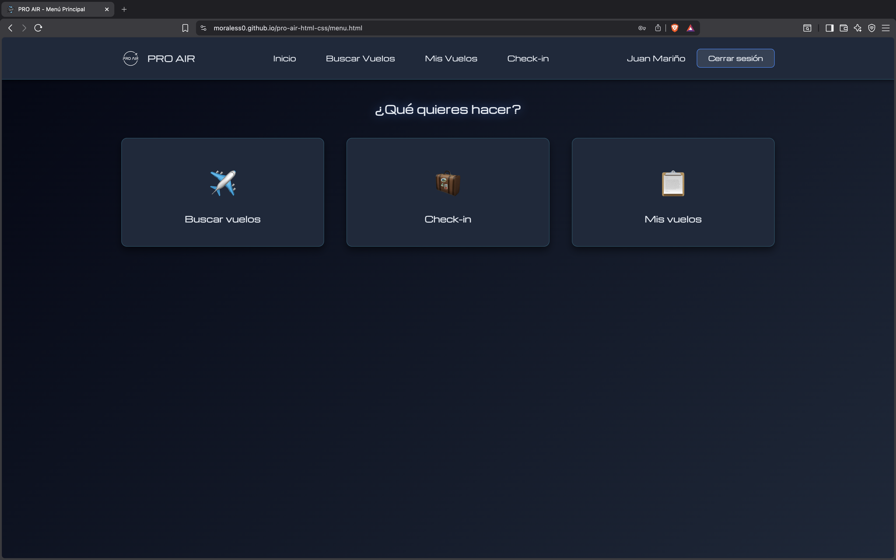
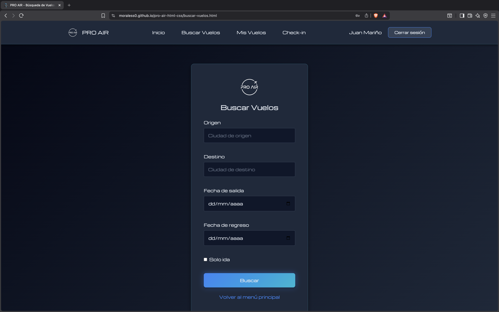
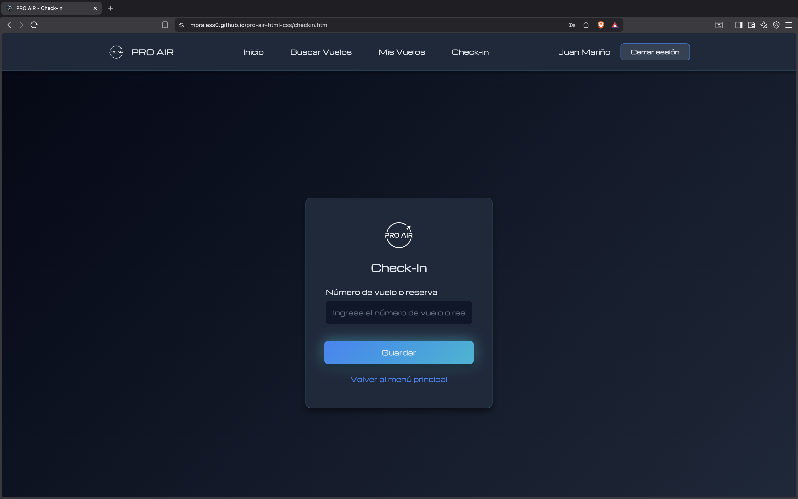
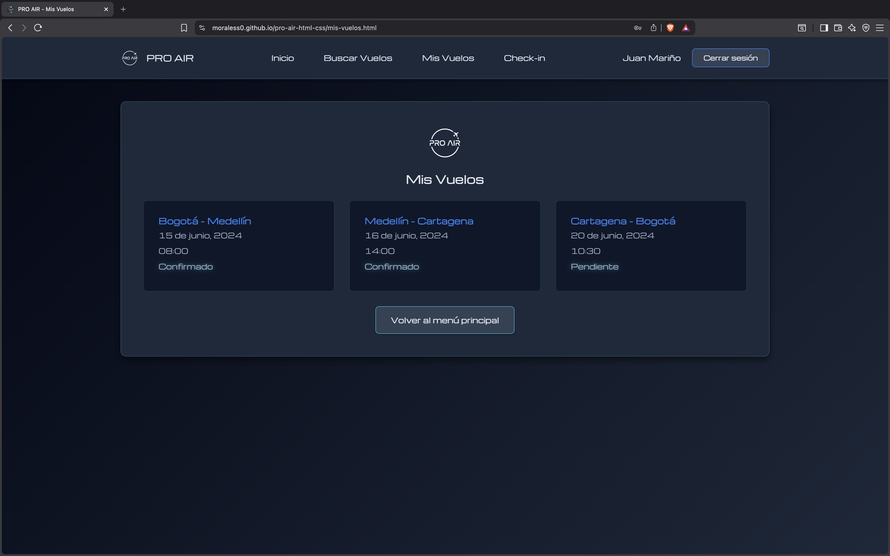
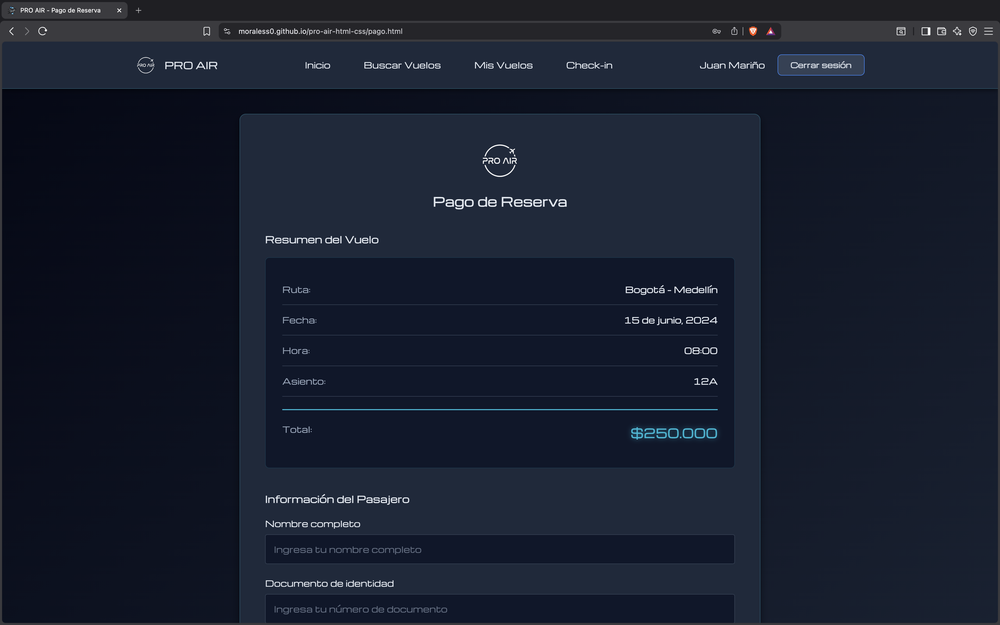
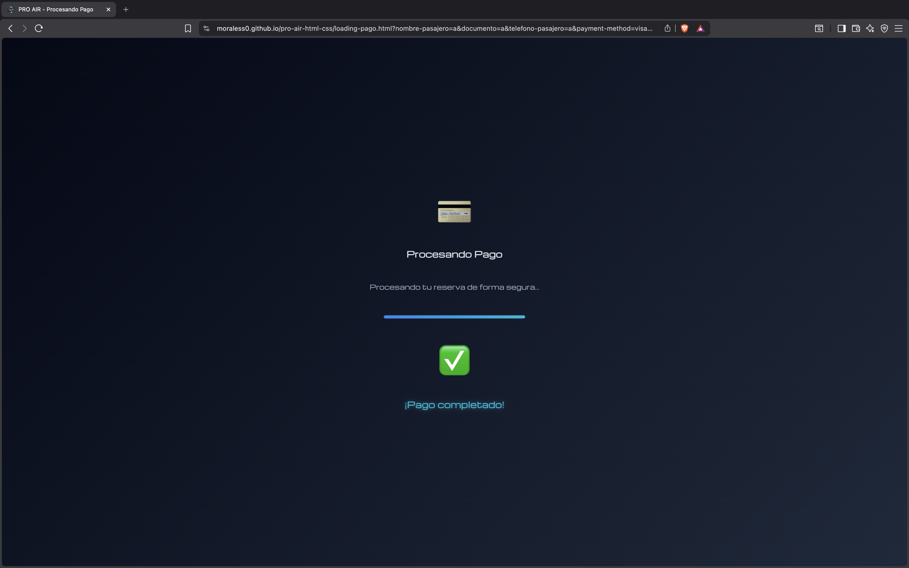

### Vista Móvil

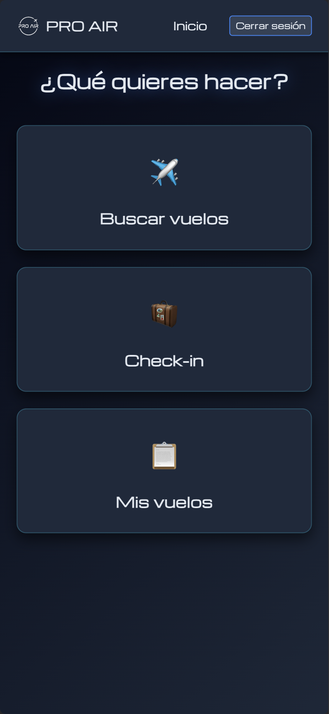
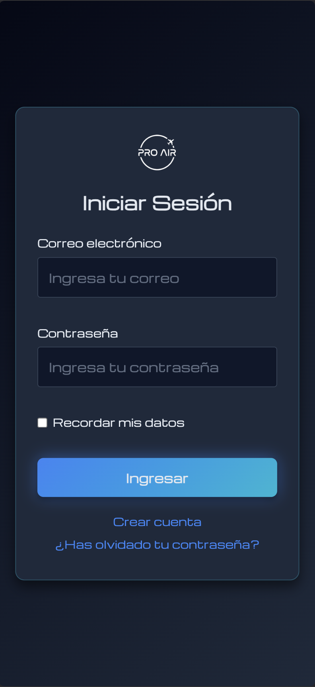
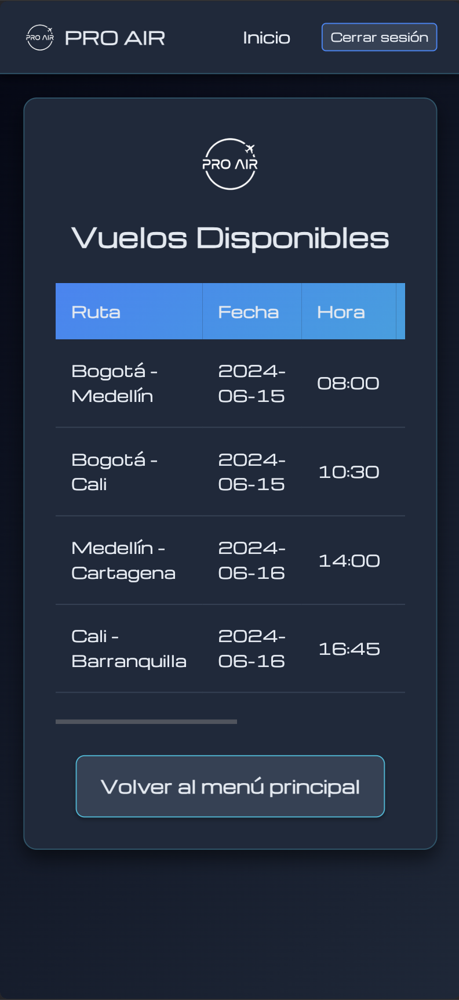
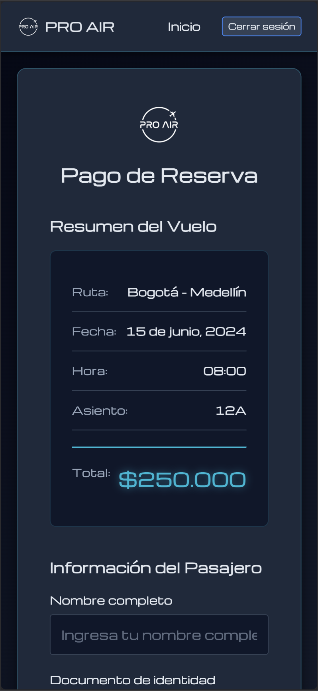
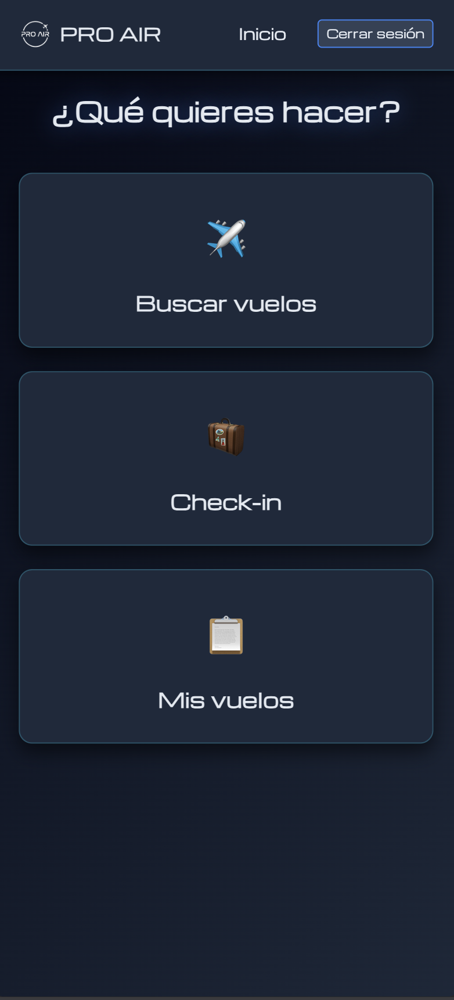
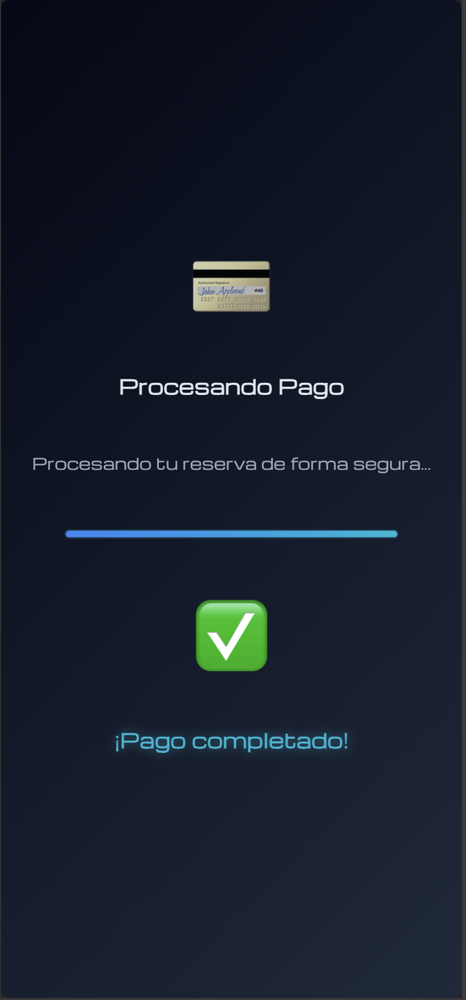

## 📝 Licencia

Este proyecto es educativo.

## 👨‍💻 Autor

Henry Abdiel Morales Galindo.

---

**¡Gracias por revisar PRO AIR!**
